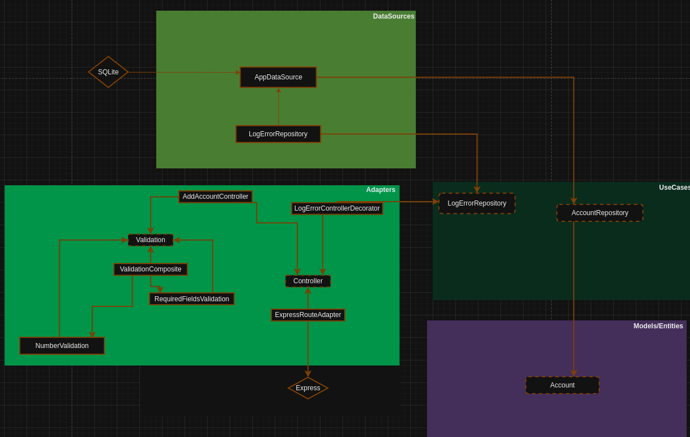

# Account Management API

## Overview

This project is an Account Management API built with TypeScript, Express, SQLite, and TypeORM.

## Table of Contents

- [Features](#features)
- [Technologies](#technologies)
- [Architecture](#architecture)
- [Setup and Installation](#setup-and-installation)
- [Usage](#usage)
- [License](#license)

## Features

- **Create Account**: Create a new account with a unique account number.
- **Get Account Balance**: Retrieve the current balance of an account.
- **Deposit Funds**: Deposit funds into an existing account.
- **Transfer Funds**: Make a transfer between two existing accounts.

## Technologies

### TypeScript

TypeScript is a strongly typed programming language that builds on JavaScript, providing better tools at any scale. I used TypeScript for its type safety, which helps catch errors early in development, and its ability to scale with larger codebases.

### Express

Express is a minimal and flexible Node.js web application framework that provides a robust set of features for developing web and mobile applications. I used Express for its simplicity and performance.

### SQLite

SQLite is a C-language library that implements a small, fast, self-contained, high-reliability, full-featured SQL database engine. I used SQLite for its simplicity in creating a database that is saved within the project, making it an excellent choice for prototyping, testing, and small-scale applications.

### TypeORM

TypeORM is an ORM (Object-Relational Mapper) for TypeScript and JavaScript (ES7, ES6, ES5). It supports many SQL-based databases. I used TypeORM to interact with our SQLite database using an object-oriented approach, which simplifies data manipulation logic. Additionally, we chose TypeORM for its ease of query manipulation and, most importantly, for the security it offers by abstracting aspects such as SQL injection and providing an additional layer of protection against common database vulnerabilities.

## Architecture

### Clean Architecture

Clean Architecture is a software design philosophy that separates the elements of a design into ring levels. The goal is to create a structure that is easy to understand, maintain, and extend. This architecture divides the system into layers, such as:

- **Entities**: Core business logic and entities.
- **Use Cases / Services**: Application-specific business rules.
- **Controllers**: Interface adapters and controllers.
- **Frameworks and Drivers**: DB, UI, external APIs, etc.

#### The architecture created



### Design Patterns

The above architecture uses several design patterns, focusing on scalability and ease of maintenance. These patterns include:

- **Adapter**: If in the future it is necessary to change a third-party library, this can be done easily as the project definitions are separated from the library.
- **Decorator**: This allows adding new functionalities, such as creating an error log, without changing a single line of existing code.
- **Factory**: This pattern isolates direct object construction calls in a single place. Thus, when a controller, for example, needs an additional functionality, I know exactly where to go and add a line to modify it.
- **Composite**: Instead of filling the controller with ifs or injecting each validation separately, I create a validation aggregator with this pattern.

## Setup and Installation

### Prerequisites

- [Node.js](https://nodejs.org/) (>=20.x)

### Installation and Execution

1. Clone the repository:

   ```bash
   git clone https://github.com/EmersonLaranja/account_management_api.git
   cd account_management_api
   ```

2. Install the dependencies:

   ```bash
   npm install
   ```

3. Run the application:
   ```bash
   npm start
   ```

## Usage

For details on how to call each functionality, the necessary parameters, and more information, refer to the [docs/details](src/docs/details.pdf) file.

## Considerations

- For simplicity, and as I am working solo on this project, I opted not to use any linting configuration.
- For the same reason, I will not enforce pushing only passing tests to the commit.
- I decided to consider Balance as a field rather than an entity.
- Thus, every account created has an initial balance of 0.
- It was requested that the project be designed with simplicity in mind. Therefore, I focused on making it as easy as possible to maintain, scale, and test.

## License

This project is licensed under the MIT License. See the [LICENSE](LICENSE) file for more details.
