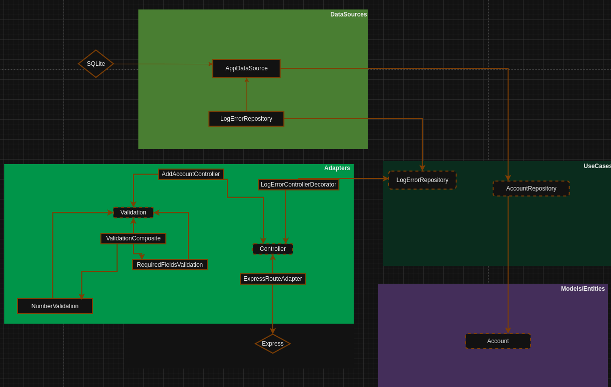

"""

# API de Gerenciamento de Contas

## Visão Geral

Este projeto é uma API de gerenciamento de contas construída com TypeScript, Express, SQLite e TypeORM.

## Índice

- [Recursos](#recursos)
- [Tecnologias](#tecnologias)
- [Arquitetura](#arquitetura)
- [Configuração e Instalação](#configuração-e-instalação)
- [Uso](#uso)
- [Considerações](#considerações)
- [Licença](#licença)

## Recursos

- **Criar Conta**: Crie uma nova conta com um número de conta exclusivo.
- **Obter Saldo da Conta**: Recupere o saldo atual de uma conta.
- **Depositar Fundos**: Deposite fundos em uma conta existente.
- **Transferir Fundos**: Faça uma transferência entre duas contas existentes.

## Tecnologias

### TypeScript

TypeScript é uma linguagem de programação fortemente tipada que se baseia no JavaScript, proporcionando melhor ferramentas em qualquer escala. Utilizei o TypeScript por sua segurança de tipos, que ajuda a detectar erros logo no desenvolvimento, e sua capacidade de escalar com bases de código maiores.

### Express

Express é um framework de aplicação web minimalista e flexível para Node.js que fornece um conjunto robusto de recursos para desenvolver aplicações web e móveis. Utilizei o Express por sua simplicidade e desempenho.

### SQLite

SQLite é uma biblioteca em linguagem C que implementa um mecanismo de banco de dados SQL pequeno, rápido, autônomo, de alta confiabilidade e completo. Utilizei o SQLite por sua simplicidade em criar um banco de dados e que fica salvo no projeto, sendo uma excelente escolha para prototipagem, testes e aplicações de pequena escala.

### TypeORM

TypeORM é um ORM (Object-Relational Mapper) para TypeScript e JavaScript (ES7, ES6, ES5). Ele suporta muitos bancos de dados baseados em SQL. Utilizei o TypeORM para interagir com nosso banco de dados SQLite usando uma abordagem orientada a objetos, o que simplifica a lógica de manipulação de dados. Além disso, escolhemos o TypeORM pela facilidade de manipular queries e, principalmente, pela segurança que ele oferece, abstraindo aspectos como injeção de SQL e proporcionando uma camada adicional de proteção contra vulnerabilidades comuns em bancos de dados.

## Arquitetura

### Arquitetura Limpa

Arquitetura Limpa é uma filosofia de design de software que separa os elementos de um design em níveis de anéis. O objetivo é criar uma estrutura que seja fácil de entender, manter e expandir. Esta arquitetura divide o sistema em camadas, como:

- **Entidades**: Lógica de negócio e entidades centrais.
- **Casos de Uso / Serviços**: Regras de negócio específicas da aplicação.
- **Controladores**: Adaptadores de interface e controladores.
- **Frameworks e Drivers**: BD, UI, APIs externas, etc.

#### A arquitetura criada



### Padrões de projeto

Na arquitetura acima foram usados alguns padrões de projeto pensando na escalabilidade e simplicidade em dar manutenção, esses padrões são:

- Adapter: Se no futuro for necessário alterar a biblioteca de um terceiro, isso será feito de forma simples pois as definições do projeto estão separadas da biblioteca
- Decorator: Com ele é possível adicionar novas funcionalidades, como usado para criar um log de erros, mas sem alterar uma linha do que estava já funcionando
- Factory: Com esse padrão eu isolo as chamadas diretas de construção de objetos em um único lugar. Assim, quando um controller, por exemplo, precisar de mais uma funcionalidade, eu já sei onde ir e adiciono uma linha para mudar.
- Composite: Ao invés de encher o controller de ifs ou ter que injetar cada validação isoladamente, eu crio um agrupador de validações com esse padrão.

## Configuração e Instalação

### Pré-requisitos

- [Node.js](https://nodejs.org/) (>=20.x)

### Instalação e Execução

1. Clone o repositório:

   ```bash
   git clone https://github.com/EmersonLaranja/account_management_api.git
   cd account_management_api
   ```

2. Instale as dependências:

   ```bash
   npm install
   ```

3. Execute a aplicação:
   ```bash
   npm start
   ```

## Uso

Os detalhes de como chamar cada funcionalidade, os parâmetros necessários e mais informações você encontra no arquivo [docs/details](src/docs/details.pdf)

## Considerações

- Por se tratar de simplicidade e eu estou fazendo um trabalho solo, optei por não usar nenhuma configuração de linting.
- Pelo mesmo motivo, não vou forçar subir para o commit apenas testes que passem.
- Tomei a decisão de considerar o Balance como um campo ao invés de uma entidade.
- Com isso toda conta ao ser criada, possui o saldo inicial de 0.
- Foi pedido que o projeto fosse feito pensando em ser simples. Com isso me dediquei para deixar o mais simples de se dar manutenção, de escalar, de testar.

## Licença

Este projeto é licenciado sob a Licença MIT. Veja o arquivo [LICENSE](LICENSE.md) para mais detalhes.

```

```
